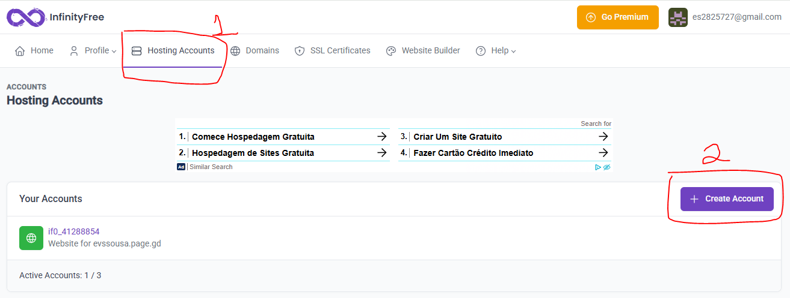
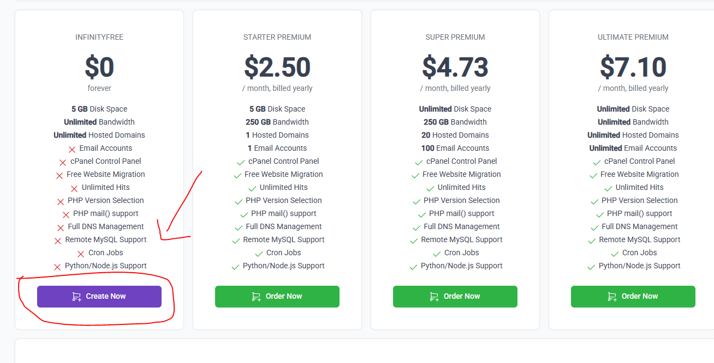
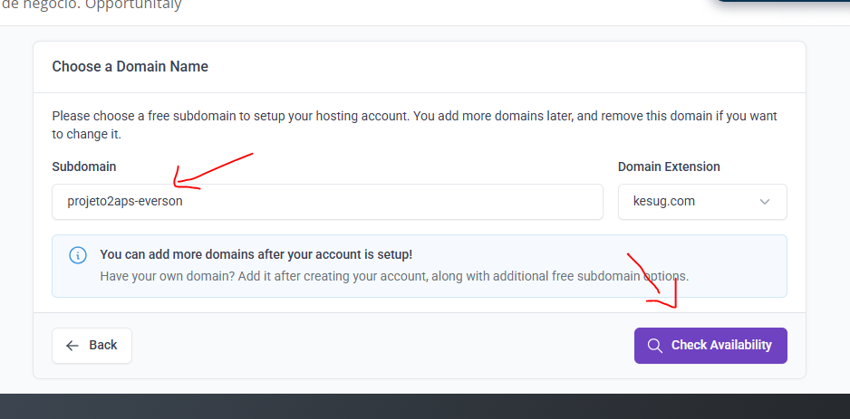
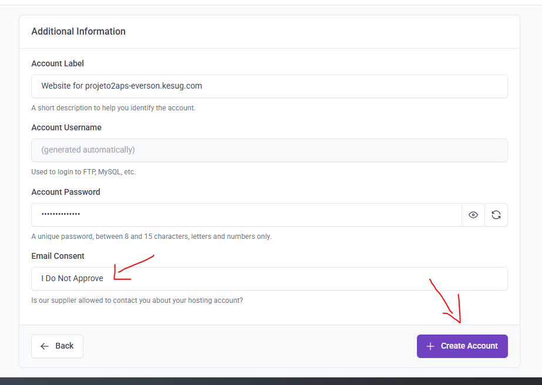
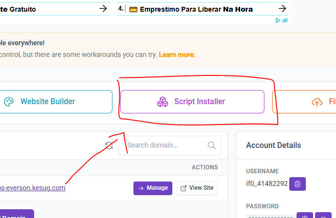
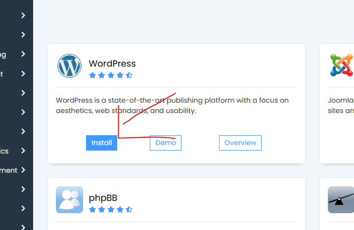
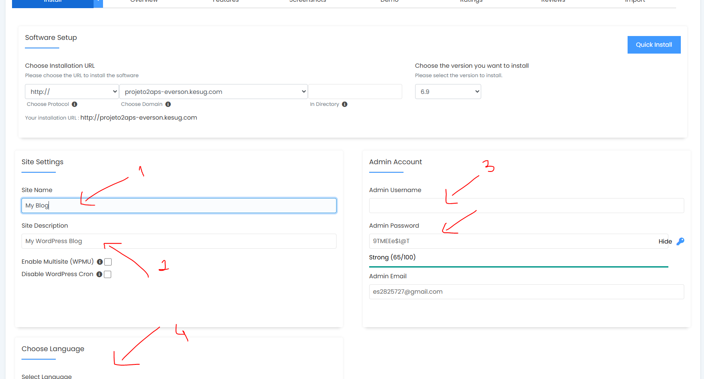
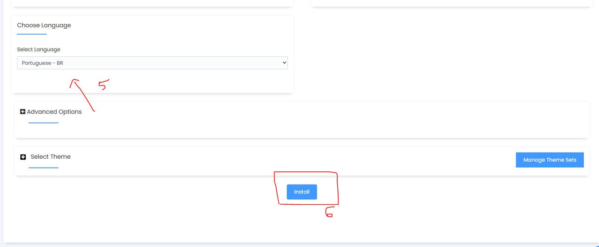
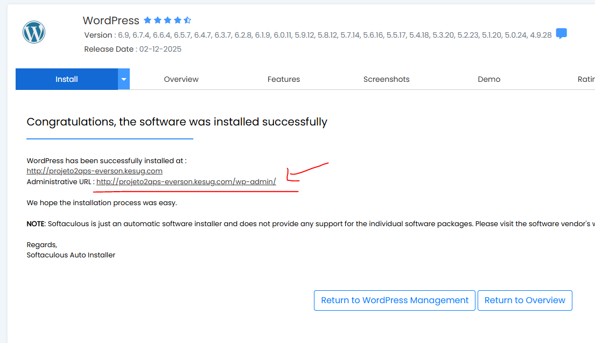

# 📘 PROJETO 2: Desenvolvimento de um Protótipo de Site para Divulgação de Curso

# 🧩 PROJETO

A escola deseja divulgar um **novo curso técnico** para atrair mais alunos.

Atualmente não existe uma página clara com informações do curso.

A direção solicitou o desenvolvimento de um **site simples de divulgação**, contendo:

- Informações sobre o curso
- Benefícios para os alunos
- Forma de contato

A equipe de vocês será responsável por **analisar e criar um protótipo funcional desse site**.

# 📋 REQUISITOS

O sistema (site) deve atender aos seguintes requisitos mínimos:

### Requisitos Funcionais

```
RF01 - O site deve apresentar o nome do curso.
RF02 - O site deve mostrar uma descrição do curso.
RF03 - O site deve apresentar benefícios ou diferenciais do curso.
RF04 - O site deve permitir que o visitante visualize informações de contato.
RF05 - O site deve possuir um botão de contato ou inscrição.
```

### Requisitos Não Funcionais

```
RNF01 - O site deve ser visualmente organizado.
RNF02 - O site deve funcionar em dispositivos móveis.
RNF03 - O site deve carregar rapidamente.
```

# 🧠 DESENVOLVIMENTO

O projeto será desenvolvido em **3 etapas principais**.

## 🔹 ETAPA 1 — Planejamento do Site

Você deve analisar o problema e planejar a estrutura do site.

## 🖊️ Diagrama

```
SITE DO CURSO
   ↓
[ Página Inicial ]
   ↓
+--------------------+
| Nome do Curso      |
+--------------------+

+--------------------+
| Sobre o Curso      |
+--------------------+

+--------------------+
| Benefícios         |
+--------------------+

+--------------------+
| Contato            |
+--------------------+
```

### ✔ Estrutura da página

```
Título do curso
Descrição
Benefícios
Imagem
Botão de contato
```

### ✔ Organização das seções

```
+----------------------+
| Título do Curso      |
+----------------------+

+----------------------+
| Descrição do Curso   |
+----------------------+

+----------------------+
| Benefícios           |
+----------------------+

+----------------------+
| Contato              |
+----------------------+
```

## 🔹 ETAPA 2 — Construção no WordPress

Você deve **transformar o planejamento em um protótipo funcional**.

Utilizando:

- WordPress
- Elementor

## Passos:

1️⃣ Criar uma página chamada **Curso Técnico**

2️⃣ Abrir com **Elementor**

3️⃣ Criar as seguintes seções:

- Título do curso
- Descrição
- Benefícios
- Contato

## 🖊️ Exemplo visual

```
+--------------------------------+
|   CURSO TÉCNICO EM TI          |
+--------------------------------+

+--------------------------------+
| Aprenda programação, redes e   |
| desenvolvimento de sistemas    |
+--------------------------------+

+--------------------------------+
| ✔ Professores especializados   |
| ✔ Laboratórios modernos        |
| ✔ Alta empregabilidade         |
+--------------------------------+

+--------------------------------+
|        [ INSCREVA-SE ]         |
+--------------------------------+
```

## 🔹 ETAPA 3 — Ajustes e Finalização

Agora você melhorar o protótipo.

Adicionar:

- Imagem
- Ícones
- Melhor organização

## 🖊️ Estrutura final esperada

```
+--------------------------------+
|        LOGO / TÍTULO           |
+--------------------------------+

+--------------------------------+
|        IMAGEM DO CURSO         |
+--------------------------------+

+--------------------------------+
|       DESCRIÇÃO DO CURSO       |
+--------------------------------+

+--------------------------------+
|         BENEFÍCIOS             |
+--------------------------------+

+--------------------------------+
|          CONTATO               |
+--------------------------------+
```

# 📦 Hospedagem e Configurações

Acesse a hospedagem **InfinityFree**: https://www.infinityfree.com/

Clique em “Register” e crie um registro com sua conta do **Github** (clique no botão de Sign up with Github)

Depois autorize seu acesso no botão **Authorize InfinityFreeHosting**

**OBS: Caso não seja possível concluir o registro, você pode tentar registrar com o Google ou criando um conta nos inputs abaixo.**

Depois de acessado, confira os prints abaixo para iniciar as configurações:











# 📦 Entrega

Para entregar seu projeto siga os passos:

1. Dentro da pasta dos projetos de APS, existe uma pasta do projeto 2
2. Nessa pasta, você irá editar o arquivo INFOS.txt
3. No arquivo você adicionar a seguinte informação:
    
    Link do site do projeto: 
    

É só!

Boas práticas! 🤙