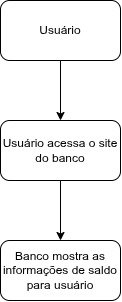

# 📘 AULA 35: FERRAMENTAS DE APOIO A ARQUITETURA: LUCIDCHART E [DRAW.IO](http://draw.io/)

## 🎯 Objetivos da aula

- Conhecer ferramentas de diagramação.
- Entender para que servem **Lucidchart** e **Draw.io**.
- Criar diagramas simples.
- Valorizar o planejamento visual.

# 🧠 Por que usar ferramentas visuais?

Antes de construir um sistema, desenhar ajuda a:

- Organizar ideias
- Explicar para equipe
- Encontrar erros cedo
- Planejar melhor

# 🖊️ Quadro

```
IDEIA → DESENHO → SISTEMA
```

# 🌐 Lucidchart

Ferramenta online para criar:

- Fluxogramas
- UML
- Organogramas
- Arquiteturas

## Vantagens

- Bonito visualmente
- Fácil compartilhar
- Trabalho em equipe online

# 🧰 Draw.io (diagrams.net)

Ferramenta gratuita muito usada.

Permite criar:

- UML
- Redes
- Fluxos
- Arquiteturas

## Vantagens

- Gratuito
- Simples
- Pode salvar localmente
- Não precisa de login inicial para usar

# 🖊️ Comparação

```
Lucidchart = online e colaborativo
Draw.io    = gratuito e prático
```

# 🧩 Exemplo de arquitetura simples



Isso pode ser desenhado nas duas ferramentas.

Fim da aula!

_


# 📝 Atividade Rápida

## Utilizando ferramentas de apoio

Desenhe essa arquitetura em uma ferramenta:

```
Aluno → Sistema Escolar → Banco de Dados
```

- Agora coloque o print da arquitetura montada na ferramenta escolhida nessa pasta com nome "sistema-escolar.jpg" (você pode aperfeiçoa-la conforme achar necessário)!