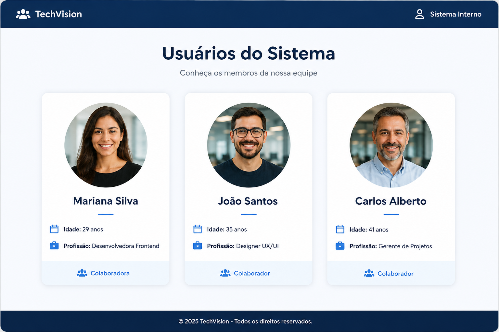

# 📘 PROJETO 6: COMPONENTE PROFILE

# 🧩 PROBLEMA

A empresa fictícia **TechVision** está desenvolvendo um sistema interno para seus funcionários.

O sistema precisa exibir informações dos usuários em cartões de perfil.

Seu trabalho será desenvolver um componente chamado `Profile` , onde os designs já criaram o wireframe:



Você deve criar o sistema de acordo com o wireframe proposto acima. As imagens dos funcionários você poderá pegar qualquer uma no Google Imagens (foto de pessoas!).

Esse componente deverá ser:

- reutilizável
- estilizado
- organizado
- fácil de manter

# 📋 PROJETO

Você deverá criar um componente React capaz de mostrar:

- Foto do usuário
- Nome
- Idade
- Profissão

O componente será reutilizado várias vezes com dados diferentes. Abaixo também está as classes utilizadas na estilização:

```
profile-card
border
padding
background-color
border-radius
```

# 📑 REQUISITOS

## RF01 — Criar componente "Profile"

O componente deve receber props:

```
nome
idade
profissao
foto
```

## RF02 — Exibir informações do usuário

O componente deve mostrar:

- imagem
- nome
- idade
- profissão

## RF03 — Utilizar Fragment

O componente deve utilizar Fragment.

## RF04 — Criar CSS "ProfileCSS"

O CSS deve estilizar:

- card
- imagem
- textos

## RF05 — Utilizar o componente 3 vezes

O `App.jsx` deve renderizar 3 usuários diferentes.

Boas práticas! 🤙