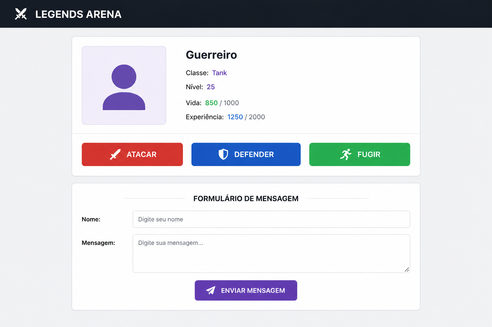

# 📘 PROJETO 7 — PAINEL DE AÇÕES RPG

# 🧩 PROBLEMA

Uma empresa de jogos está desenvolvendo um novo MMORPG chamado **Legends Arena**.

O sistema precisa de uma interface onde o jogador possa:

- visualizar informações do personagem
- executar ações rápidas
- enviar mensagens
- utilizar componentes reutilizáveis

Seu trabalho será desenvolver esse painel utilizando React.

# 📋 PROJETO

Você deverá criar uma interface RPG contendo:

- um card de personagem
- botões de ação
- formulário de mensagem
- estilização completa com CSS
- componentes reutilizáveis

# 📁 ESTRUTURA OBRIGATORIA

```
src/
├── components/
│   ├── Card/
│   │   ├── index.jsx
│   │   ├── style.css
│   ├── Botao/
│   │   ├── index.jsx
│   │   ├── style.css
│   ├── FormularioMensagem/
│   │   ├── index.jsx
│   │   ├── style.css
├── App.jsx
└── App.test.jsx
```

# 📑 REQUISITOS

## RF01 — Criar componente Card

O componente deve:

- utilizar `children`
- funcionar como container reutilizável
- possuir estilização própria

## RF02 — Criar componente Botao

O componente deve:

- receber:
    - `texto`
    - `...rest`
- permitir:
    - `onClick`
    - `type`
    - `id`
- possuir estilização própria

## RF03 — Criar componente FormularioMensagem

O componente deve possuir:

- input nome
- input mensagem
- botão enviar

## RF04 — Trabalhar com Eventos

Os botões devem possuir:

- Atacar
- Defender
- Fugir

## RF05 — Funcionalidade dos Botões

Ao clicar nos botões deve mostrar alertas diferentes.

Exemplos:

- "Atacando inimigo!"
- "Defendendo posição!"
- "Fugindo da batalha!"

## RF06 — Trabalhar com onSubmit

O formulário deve:

- utilizar `onSubmit`
- utilizar `preventDefault`
- mostrar alert com:
    - nome
    - mensagem

## RF07 — Trabalhar com CSS

Todos os componentes devem possuir `style.css`.

## RF08 — Trabalhar com Organização Profissional

Cada componente deve possuir:

- pasta própria
- CSS próprio

# 🖼️ TELA DO PROJETO

O aluno deverá criar uma interface semelhante a esta:



Boas práticas! 🤙